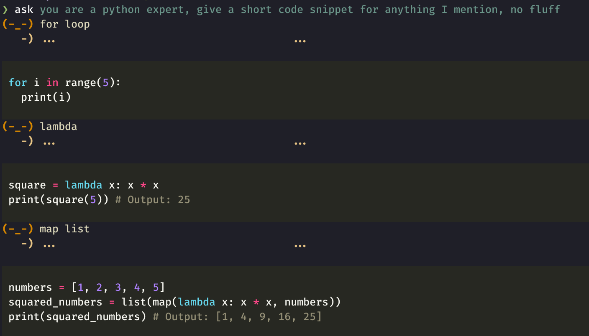

# An AI command line chat bot

An AI chat bot you can run from the command line. It provides a proxy onto the
underlying [Google Gemini APIs](https://ai.google.dev/#gemini-api). When you
start the chat bot you provide a context, either an opening question, file
inputs or a prompt template. From that point you can ask further questions
from that context.



https://github.com/user-attachments/assets/52ea95f9-583b-4388-b9ca-c5458643fb7b

You can try this out at no cost if you are in a region that is eligible for the
Gemini API free usage.

If you set up an voice to text transcribe service then you can control the command line with voice. See below for details.

## Installation

You can either run direct from source

    pip3 install -r requirements.txt
    python ask/ask.py hello

Or install globally

    pip install .
    ask hello

Or install globally in editable mode, for example if you want to make modifications to the code

    pip install -e .
    ask hello

## Getting started

You'll need a Gemini API Key to get started. You can get one from the [Google AI Studio](https://aistudio.google.com/). Set the key as an environment variable.

    export GEMINI_API_KEY=my-super-secret-key

Then start a chat

    ask

You can pass the contents of a file in as an input

    ask file.txt

Or ask a question to work on

    ask what time is love

Hit return to ask the default question, e.g. proof read or answer the question.
Or elaborate and ask more.

## Voice to text

Provide inputs from voice by setting up a text service that outputs transcribed
text to the file `/tmp/transcribe.txt`.

For example build [whisper.cpp](https://github.com/ggerganov/whisper.cpp) and run in another shell.

    git clone https://github.com/ggerganov/whisper.cpp.git
    cd whisper.cpp
    bash ./models/download-ggml-model.sh small.en
    make
    ./stream -m models/ggml-large-v3-q5_0.bin --length 1000 --keep 0 -f /tmp/transcribe.txt

## Example

Start off a chat on a given theme and then quick fire requests

```sh
❯ ask show me terraform for the following
```

(-\_-) s3

```terraform
resource "aws_s3_bucket" "example" {
  bucket = "my-bucket-name"

  acl = "private"

  tags = {
    Name = "My bucket"
  }
}
```

(-\_-) vpc

```terraform
resource "aws_vpc" "main" {
  cidr_block = "10.0.0.0/16"

  enable_dns_hostnames = true
  enable_dns_support = true
}

resource "aws_subnet" "public" {
  vpc_id = aws_vpc.main.id
  cidr_block = "10.0.1.0/24"
  map_public_ip_on_launch = true
}
```

(-\_-) rds

```terraform
resource "aws_db_instance" "default" {
  allocated_storage = 10
  engine             = "mysql"
  engine_version     = "5.7.28"
  instance_class     = "db.t2.micro"
  name               = "mydb"
  username           = "admin"
  password           = "password"
  db_subnet_group_name = "default"
}

resource "aws_db_subnet_group" "default" {
  name       = "default"
  subnet_ids = [aws_subnet.public.id]
}
```

## Prompt templates

You can build up a library of prompt templates for your use cases.

For example you can start with the provided `lexical.txt` prompt as an example.

    ask --template lexical.txt dog poodle fish

This prompt template has `{}` placeholders, e.g.

    You are skilled lexical scanner. Can you tell me whether the phrase {} relates to phrase 1 or phrase 2 below
    Phrase 1: {}
    Phrase 2: {}

You should get content like:

    The phrase "dog" relates to **phrase 1: poodle**.
    "Poodle" is a type of dog, making them both related.  "Fish" is a completely different animal category.

You can create a prompt directory for your collection of personal of prompts and
then set this directory with the env variable name `ASK_PROMPT_DIRECTORY`. Each
prompt should be defined in a `.txt` files in that directory. Then refer to the
template with the base name. For example the following would use `my-prompt` in
the `ASK_PROMPT_DIRECTORY` directory.

    ask --template my-prompt one two three

## One shot question and answer

Ask a one shot question and expect a single answer

    ask --one explain relativity to me in 100 words

You can enable this mode in the shell using the `ASK_PIPELINE` environment variable.

    export ASK_PIPELINE=one-shot
    ask can you describe Falmouth
    ask pi to 100 decimal places
